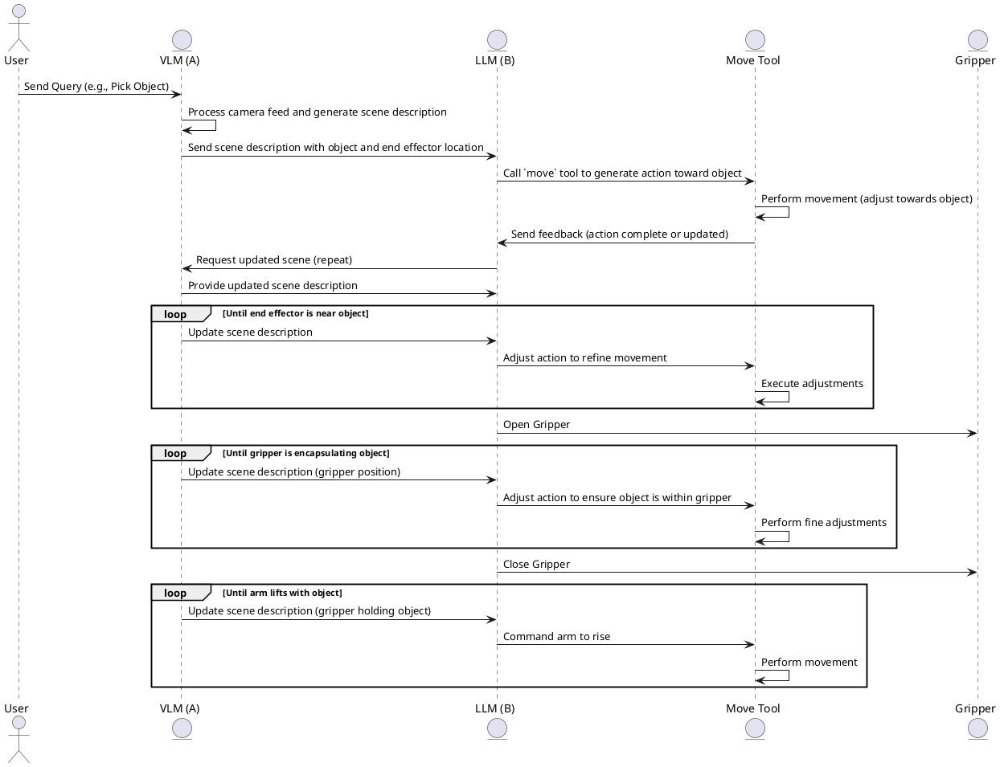
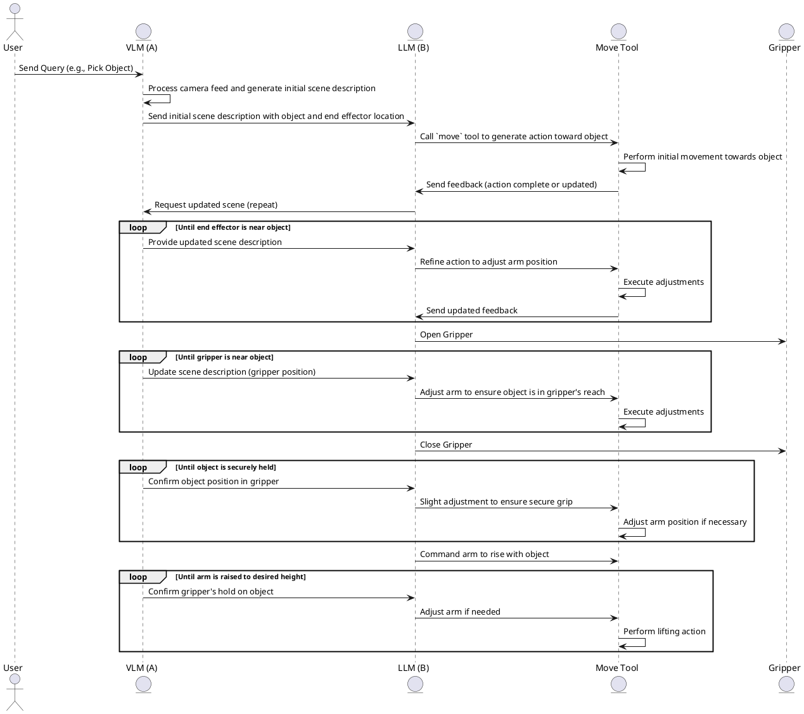
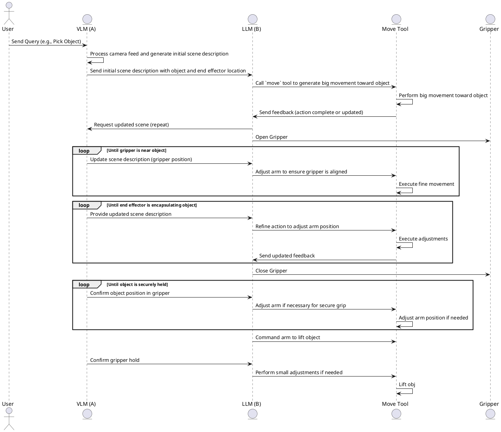

### Proposed solution

```plantuml
@startuml

actor User
entity "VLM (A)" as VLM_A
entity "LLM (B)" as LLM_B
entity "Move Tool" as Move_Tool
entity "Gripper" as Gripper

User -> VLM_A : Send Query (e.g., Pick Object)
VLM_A -> VLM_A : Process camera feed and generate scene description
VLM_A -> LLM_B : Send scene description with object and end effector location
LLM_B -> Move_Tool : Call `move` tool to generate action toward object
Move_Tool -> Move_Tool : Perform movement (adjust towards object)
Move_Tool -> LLM_B : Send feedback (action complete or updated)
LLM_B -> VLM_A : Request updated scene (repeat)
VLM_A -> LLM_B : Provide updated scene description
loop Until end effector is near object
    VLM_A -> LLM_B : Update scene description
    LLM_B -> Move_Tool : Adjust action to refine movement
    Move_Tool -> Move_Tool : Execute adjustments
end

LLM_B -> Gripper : Open Gripper
loop Until gripper is encapsulating object
    VLM_A -> LLM_B : Update scene description (gripper position)
    LLM_B -> Move_Tool : Adjust action to ensure object is within gripper
    Move_Tool -> Move_Tool : Perform fine adjustments
end

LLM_B -> Gripper : Close Gripper
loop Until arm lifts with object
    VLM_A -> LLM_B : Update scene description (gripper holding object)
    LLM_B -> Move_Tool : Command arm to rise
    Move_Tool -> Move_Tool : Perform movement
end

@enduml
```

### GPT solution

```plantuml
@startuml

actor User
entity "VLM (A)" as VLM_A
entity "LLM (B)" as LLM_B
entity "Move Tool" as Move_Tool
entity "Gripper" as Gripper

User -> VLM_A : Send Query (e.g., Pick Object)
VLM_A -> VLM_A : Process camera feed and generate initial scene description
VLM_A -> LLM_B : Send initial scene description with object and end effector location
LLM_B -> Move_Tool : Call `move` tool to generate action toward object
Move_Tool -> Move_Tool : Perform initial movement towards object
Move_Tool -> LLM_B : Send feedback (action complete or updated)
LLM_B -> VLM_A : Request updated scene (repeat)

loop Until end effector is near object
    VLM_A -> LLM_B : Provide updated scene description
    LLM_B -> Move_Tool : Refine action to adjust arm position
    Move_Tool -> Move_Tool : Execute adjustments
    Move_Tool -> LLM_B : Send updated feedback
end

LLM_B -> Gripper : Open Gripper
loop Until gripper is near object
    VLM_A -> LLM_B : Update scene description (gripper position)
    LLM_B -> Move_Tool : Adjust arm to ensure object is in gripper's reach
    Move_Tool -> Move_Tool : Execute adjustments
end

LLM_B -> Gripper : Close Gripper
loop Until object is securely held
    VLM_A -> LLM_B : Confirm object position in gripper
    LLM_B -> Move_Tool : Slight adjustment to ensure secure grip
    Move_Tool -> Move_Tool : Adjust arm position if necessary
end

LLM_B -> Move_Tool : Command arm to rise with object
loop Until arm is raised to desired height
    VLM_A -> LLM_B : Confirm gripper's hold on object
    LLM_B -> Move_Tool : Adjust arm if needed
    Move_Tool -> Move_Tool : Perform lifting action
end

@enduml
```

### Combined solution

```plantuml
@startuml

actor User
entity "VLM (A)" as VLM_A
entity "LLM (B)" as LLM_B
entity "Move Tool" as Move_Tool
entity "Gripper" as Gripper

User -> VLM_A : Send Query (e.g., Pick Object)
VLM_A -> VLM_A : Process camera feed and generate initial scene description
VLM_A -> LLM_B : Send initial scene description with object and end effector location
LLM_B -> Move_Tool : Call `move` tool to generate big movement toward object
Move_Tool -> Move_Tool : Perform big movement toward object
Move_Tool -> LLM_B : Send feedback (action complete or updated)
LLM_B -> VLM_A : Request updated scene (repeat)

LLM_B -> Gripper : Open Gripper
loop Until gripper is near object
    VLM_A -> LLM_B : Update scene description (gripper position)
    LLM_B -> Move_Tool : Adjust arm to ensure gripper is aligned
    Move_Tool -> Move_Tool : Execute fine movement
end

loop Until end effector is encapsulating object
    VLM_A -> LLM_B : Provide updated scene description
    LLM_B -> Move_Tool : Refine action to adjust arm position
    Move_Tool -> Move_Tool : Execute adjustments
    Move_Tool -> LLM_B : Send updated feedback
end

LLM_B -> Gripper : Close Gripper
loop Until object is securely held
    VLM_A -> LLM_B : Confirm object position in gripper
    LLM_B -> Move_Tool : Adjust arm if necessary for secure grip
    Move_Tool -> Move_Tool : Adjust arm position if needed
end

LLM_B -> Move_Tool : Command arm to lift object
loop Until arm has picked up object
    VLM_A -> LLM_B : Confirm gripper hold
    LLM_B -> Move_Tool : Perform small adjustments if needed
    Move_Tool -> Move_Tool : Lift obj
```